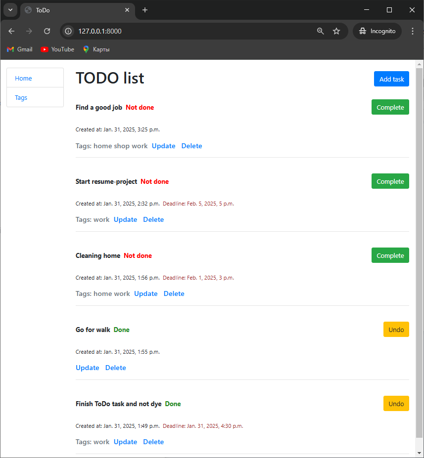

# ToDo_list
Todo-list django-project for practice-lesson Mate Academy

# Features
- Add new task:
  - possible to set-up deadline
  - tags can be created and added to task optionally
- Easy creation, updating, deletion tags without any confirmation
- Easy choosing tag for task during creation by checkbox
- Each task has easily switched statuses Complete or Undo

# Demonsration
